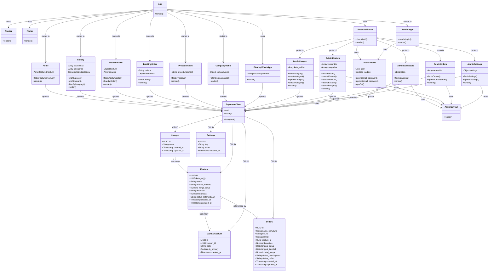

# Class Diagram - Roro Kostum System

## Diagram Arsitektur Sistem

## Penjelasan Diagram

### 1. Database Layer (Top)
**Tabel-tabel database:**
- **Kategori**: Menyimpan kategori kostum (Adat, Karakter, Profesi, dll)
- **Kostum**: Menyimpan data kostum yang tersedia
- **GambarKostum**: Menyimpan gambar-gambar kostum
- **Orders**: Menyimpan data pesanan dari pelanggan
- **Settings**: Menyimpan konfigurasi aplikasi (WhatsApp, prosedur sewa, dll)

**Relasi:**
- Kategori memiliki banyak Kostum (1:N)
- Kostum memiliki banyak GambarKostum (1:N)
- Kostum direferensikan oleh banyak Orders (1:N)

### 2. Service Layer (Middle)
**SupabaseClient**: Client untuk berinteraksi dengan database Supabase
**AuthContext**: Context provider untuk manajemen autentikasi

### 3. Component Layer (Bottom)

#### Core Components
- **App**: Komponen utama aplikasi dengan routing
- **Navbar**: Navigation bar untuk semua halaman
- **Footer**: Footer untuk halaman publik
- **FloatingWhatsApp**: Tombol floating WhatsApp
- **ProtectedRoute**: HOC untuk proteksi route admin
- **AdminLayout**: Layout untuk halaman admin

#### Public Pages
- **Home**: Halaman utama dengan kostum unggulan
- **Gallery**: Galeri kostum dengan filter kategori
- **DetailKostum**: Detail kostum dan form order
- **TrackingOrder**: Tracking status pesanan
- **ProsedurSewa**: Halaman prosedur sewa
- **CompanyProfile**: Profil perusahaan dan lokasi

#### Admin Pages
- **AdminLogin**: Halaman login admin
- **AdminDashboard**: Dashboard statistik
- **AdminKategori**: CRUD kategori
- **AdminKostum**: CRUD kostum dan upload gambar
- **AdminOrders**: Manajemen pesanan
- **AdminSettings**: Pengaturan aplikasi

### 4. Data Flow
1. **User mengakses halaman** → Component melakukan query ke SupabaseClient
2. **SupabaseClient** → Melakukan operasi CRUD ke database
3. **Database** → Mengembalikan data sesuai dengan RLS policy
4. **Component** → Menampilkan data ke user

### 5. Authentication Flow
1. User login melalui **AdminLogin**
2. **AdminLogin** memanggil method di **AuthContext**
3. **AuthContext** berkomunikasi dengan **SupabaseClient.auth**
4. Session disimpan dan digunakan oleh **ProtectedRoute**
5. **ProtectedRoute** mengecek autentikasi sebelum mengizinkan akses ke halaman admin

## Teknologi yang Digunakan
- **Frontend**: React 18 + Vite
- **Routing**: React Router DOM v6
- **Database**: Supabase (PostgreSQL)
- **Authentication**: Supabase Auth
- **Storage**: Supabase Storage (untuk gambar kostum)
- **Styling**: CSS Modules

## Security
- Row Level Security (RLS) diaktifkan pada semua tabel
- Public dapat membaca data kostum
- Hanya authenticated users yang dapat melakukan operasi write
- Protected routes untuk halaman admin
