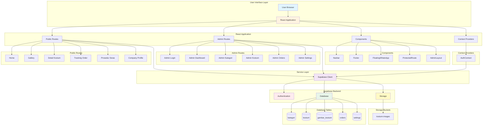
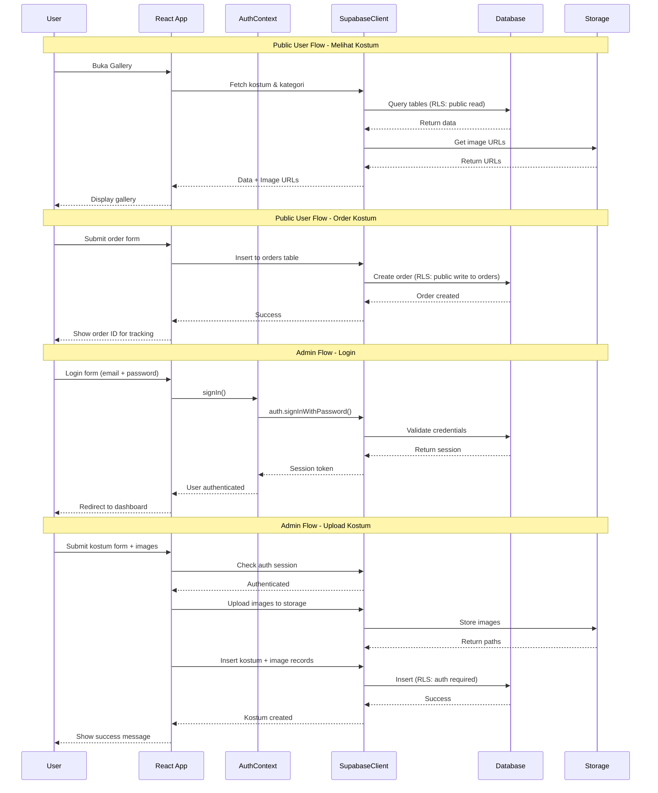
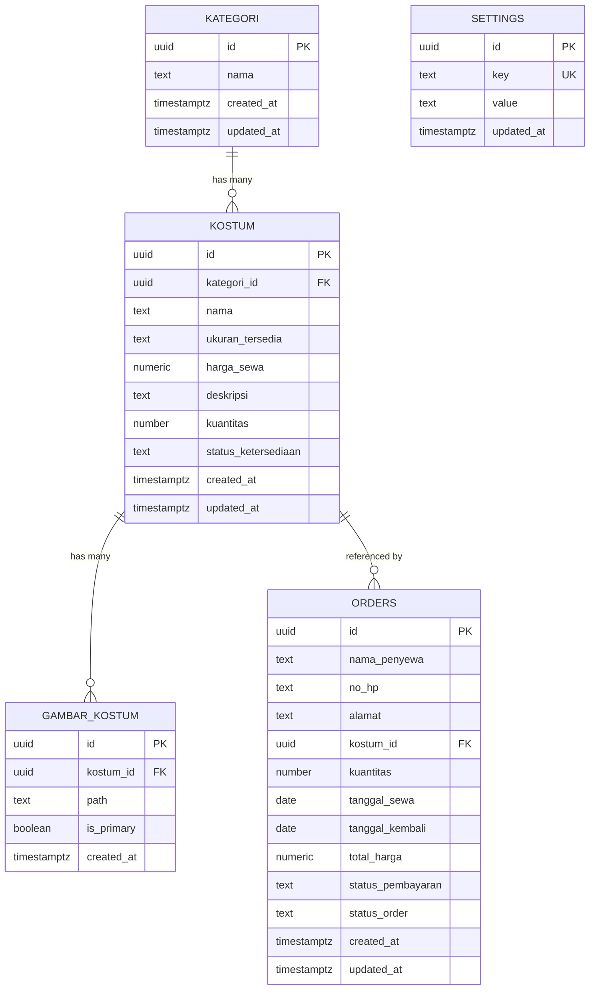
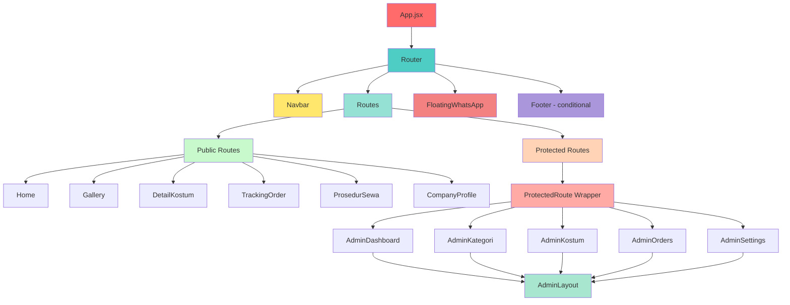

# Arsitektur Sistem - Roro Kostum

## Diagram Arsitektur Keseluruhan



## Diagram Flow Data



## Diagram Entity Relationship (ERD)



## Diagram Component Hierarchy



## Penjelasan Lapisan Arsitektur

### 1. User Interface Layer
- **User Browser**: Interface yang diakses oleh end user
- **React Application**: Single Page Application (SPA) yang dibangun dengan React + Vite

### 2. Application Layer
Terdiri dari 4 bagian utama:

#### a. Public Routes
Halaman yang dapat diakses tanpa autentikasi:
- Home: Menampilkan kostum unggulan
- Gallery: Katalog kostum dengan filter
- Detail Kostum: Detail + form order
- Tracking Order: Cek status pesanan
- Prosedur Sewa: Info syarat & ketentuan
- Company Profile: Info perusahaan & lokasi

#### b. Admin Routes
Halaman yang memerlukan autentikasi:
- Admin Login: Form login
- Admin Dashboard: Statistik & overview
- Admin Kategori: Manajemen kategori
- Admin Kostum: Manajemen kostum
- Admin Orders: Manajemen pesanan
- Admin Settings: Pengaturan aplikasi

#### c. Components
Komponen reusable:
- Navbar: Navigation bar
- Footer: Footer info
- FloatingWhatsApp: Tombol chat WhatsApp
- ProtectedRoute: HOC untuk proteksi route
- AdminLayout: Layout sidebar admin

#### d. Context Providers
- AuthContext: State management autentikasi

### 3. Service Layer
**Supabase Client**: Single instance untuk semua operasi backend
- Authentication
- Database queries
- Storage operations
- Real-time subscriptions

### 4. Backend Layer (Supabase)

#### a. Authentication
- Email/Password authentication
- Session management
- JWT tokens

#### b. Database (PostgreSQL)
5 tabel utama dengan Row Level Security:
- kategori: Master kategori kostum
- kostum: Data kostum
- gambar_kostum: Gambar kostum
- orders: Data pesanan
- settings: Konfigurasi aplikasi

#### c. Storage
- kostum-images: Bucket untuk menyimpan gambar kostum

## Security Features

### Row Level Security (RLS)
Semua tabel menggunakan RLS dengan policy:

**Public Access:**
- SELECT: kategori, kostum, gambar_kostum, settings
- INSERT: orders (untuk membuat pesanan)

**Authenticated Access:**
- INSERT/UPDATE/DELETE: kategori, kostum, gambar_kostum, settings, orders

### Authentication
- Supabase Auth dengan email/password
- JWT token untuk session
- Protected routes untuk halaman admin
- Auto redirect jika tidak authenticated

## Technology Stack

### Frontend
- **Framework**: React 18
- **Build Tool**: Vite 6
- **Routing**: React Router DOM v6
- **Styling**: CSS Modules
- **State Management**: React Context API

### Backend (Supabase)
- **Database**: PostgreSQL with RLS
- **Authentication**: Supabase Auth
- **Storage**: Supabase Storage
- **API**: Auto-generated REST API

### Deployment
- **Frontend**: Static hosting (Netlify/Vercel)
- **Backend**: Supabase Cloud

## Data Flow Patterns

### 1. Read Operations (Public)
```
User → React Component → Supabase Client → Database (RLS Check) → Return Data → Display
```

### 2. Write Operations (Public - Orders only)
```
User → Form → Validation → Supabase Client → Database (RLS Check) → Insert → Return ID
```

### 3. Admin Operations
```
User → Login → AuthContext → Session Token → Protected Route → Admin Page →
Supabase Client (with token) → Database (RLS Check with auth) → CRUD Operation → Success
```

### 4. Image Upload
```
Admin → Upload Form → Validate → Supabase Storage → Get URL →
Insert to gambar_kostum table → Link to kostum → Success
```

## Key Features

### Public Features
1. Browse kostum by category
2. View kostum details with images
3. Submit rental orders
4. Track order status
5. View rental procedures
6. Contact via WhatsApp
7. View company info & location

### Admin Features
1. Dashboard with statistics
2. CRUD categories
3. CRUD kostum with image upload
4. Manage orders & update status
5. Configure app settings
6. Update company info
7. Manage social media links

## Performance Considerations

1. **Image Optimization**: Images stored in Supabase Storage with CDN
2. **Lazy Loading**: Images loaded on demand
3. **Indexes**: Database indexes on foreign keys and frequently queried fields
4. **RLS Optimization**: Efficient policies to minimize query overhead
5. **Component Code Splitting**: React Router code splitting for route-based chunks
